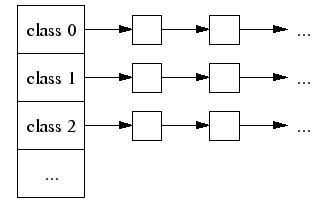
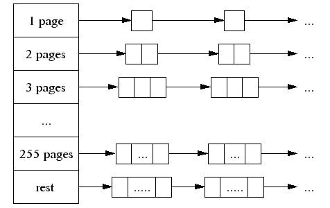

# TCMalloc

TCMalloc 是 Google 开发的内存分配器。它具有现代化内存分配器的基本特征：对抗内存碎片、在多核处理器能够 scale。
TCMalloc 还减少了多线程程序的锁争用。

## 基本概念

- 空闲列表(FreeList)
- 线程缓存(ThreadCache)

    TCMalloc 为每个线程分配一个线程本地缓存。线程本地缓存满足小分配。对象根据需要从中央数据结构移动到线程本地缓存中，并使用定期垃圾收集将内存从线程本地缓存迁移回中央数据结构

- 中央缓存(CentralCache)
- 中央页堆(PageHeap)
- 中央页面分配器

ThreadCache, CentralCache, PageHeap都有空闲列表，区别在于粒度不同

## 小对象分配

小于32K的对象叫小对象，其余叫大对象。

每个小对象大小映射到大约 170 个可分配的大小类之一。例如，961 到 1024 字节范围内的所有分配都向上舍入到 1024。大小类之间的间隔是这样的：小尺寸分隔 8 个字节，较大尺寸分隔 16 个字节，更大尺寸分隔 32 个字节，依此类推. 最大间距（大小 >= ~2K）为 256 字节。

线程缓存包含每个大小类的空闲对象的单向链接列表。

### 小对象分配流程

1. 我们将其大小映射到相应的大小类

2. 在线程缓存中查找当前线程对应的空闲列表

    1. 如果空闲列表不为空，我们从列表中删除第一个对象并返回它。当遵循这条快速路径时，TCMalloc 根本不获取锁。这有助于显着加快分配速度

    2. 如果空闲列表为空，我们从这个大小类的中央空闲列表中获取一堆对象，将它们放入线程局部空闲列表中。将新获取的对象之一返回给应用程序。

    3. 如果中央空闲列表也为空，我们从中央页面分配器分配一系列页面。将页面拆分为一组此大小类的对象。将新对象放置在中央空闲列表上。和以前一样，将这些对象中的一些移动到线程本地空闲列表中。

### 大对象分配流程

大对象大小 (> 32K) 向上舍入为页面大小 (4K) 并由中央页堆处理。中心页堆又是一个空闲列表数组。

找到满足大小要求的位置。如果该空闲列表为空，则查看下一个空闲列表，依此类推。最后，如有必要，我们会查看最后一个空闲列表。如果失败，我们从系统中获取内存。
